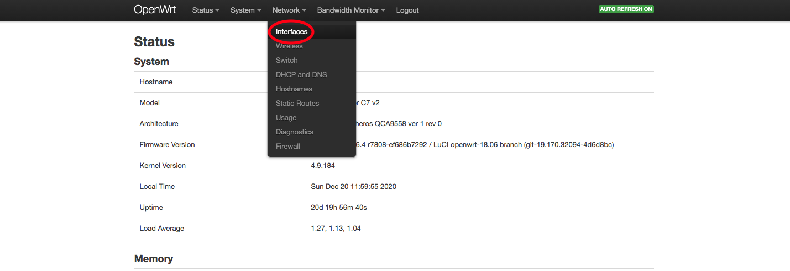
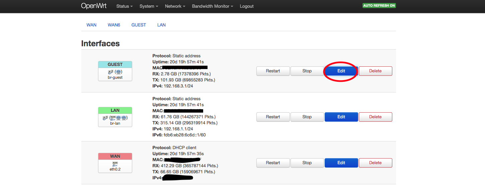
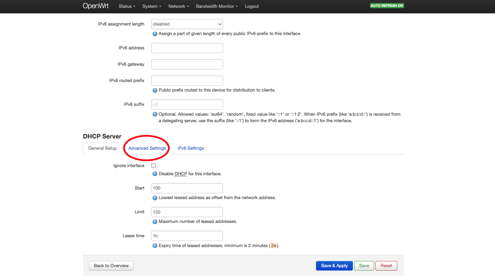
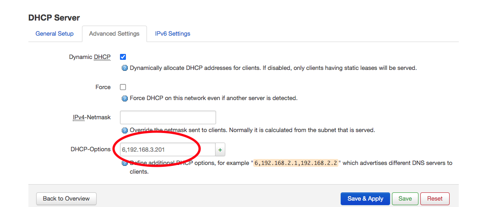

# OpenWRT Custom DNS
## Use Case
I want to route all traffic for a specific interface through pi-hole.

## Instructions
OpenWRT should be using `dnsmasq`. To set the DNS, we need touse custom DHCP-Options.

Navigate to the interfaces page.

Select the interface you would like to edit

Scroll down to the DHCP section and select "Advanced"

Set the custom DNS. We want to use option 6, so the syntax is `6,<address1>,<address2>` etc.

Click "Save and Apply." All done!
